"""# Enciclopédia Viking

[](https://developer.mozilla.org/pt-BR/docs/Web/HTML)
[](https://opensource.org/licenses/MIT)

## 🇧🇷 Português

### 📋 Descrição

Este projeto é uma enciclopédia interativa sobre a cultura Viking, desenvolvida como parte do módulo 3 da trilha de HTML da DIO. O objetivo foi recriar a experiência de uma enciclopédia online, similar à Wikipédia, focando em um layout moderno e responsivo. O conteúdo abrange diversos aspectos da vida Viking, desde sua história e personagens notáveis até suas batalhas e rica cultura.

### 🖼️ Imagem Hero


### 🗺️ Diagrama de Arquitetura

```mermaid
graph TD
    A[Enciclopédia Viking] --> B[Navegação Global]
    B --> B1[Menu Principal nav]
    A --> C[Páginas do Site]
    C --> P1[index.html · Introdução]
    C --> P2[personagens.html · Figuras Históricas]
    C --> P3[batalhas.html · Batalhas e Conquistas]
    C --> P4[cultura.html · Cultura e Religião]
    P1 --> D[Estrutura de Página]
    P2 --> D
    P3 --> D
    P4 --> D
    D --> D1[header · Cabeçalho]
    D --> D2[main · Conteúdo Principal]
    D --> D3[footer · Rodapé]
    D2 --> E[Elementos HTML5]
    E --> E1[section · Seções]
    E --> E2[article · Artigos]
    E --> E3[table · Tabelas]
    E --> E4[ol · ul · Listas]
```




### Páginas incluídas

- `src/index.html`: Introdução ao mundo viking
- `src/personagens.html`: Personagens históricos como Ragnar e Lagertha
- `src/batalhas.html`: Batalhas famosas e conquistas
- `src/cultura.html`: Cultura, religião e costumes

### Recursos utilizados

- Tags semânticas do HTML5 (`<header>`, `<main>`, `<section>`, `<article>`, `<footer>`)
- Tabelas
- Listas ordenadas e não ordenadas
- Navegação entre páginas com `<nav>`

### 📦 Instalação

Não é necessária nenhuma instalação. Basta clonar o repositório e abrir o arquivo `src/index.html` em seu navegador preferido.

```bash
git clone https://github.com/galafis/-Recriando-o-Wikipedia-com-Layout-Moderno.git
cd -Recriando-o-Wikipedia-com-Layout-Moderno
```

### 💻 Uso

Após abrir o `src/index.html`, você pode navegar pelas diferentes seções da enciclopédia utilizando o menu de navegação. Explore as páginas sobre personagens, batalhas e cultura para aprender mais sobre os Vikings.

### 📄 Licença

Este projeto está licenciado sob a Licença MIT. Veja o arquivo `LICENSE` para mais detalhes.

### Autor

**Gabriel Demetrios Lafis**

---

## 🇬🇧 English

### 📋 Description

This project is an interactive encyclopedia about Viking culture, developed as part of module 3 of DIO's HTML track. The goal was to recreate the experience of an online encyclopedia, similar to Wikipedia, focusing on a modern and responsive layout. The content covers various aspects of Viking life, from their history and notable figures to their battles and rich culture.

### 🖼️ Hero Image


### 🗺️ Architecture Diagram

```mermaid
graph TD
    A[Viking Encyclopedia] --> B[Global Navigation]
    B --> B1[Main Menu nav]
    A --> C[Site Pages]
    C --> P1[index.html · Introduction]
    C --> P2[personagens.html · Historical Figures]
    C --> P3[batalhas.html · Battles & Conquests]
    C --> P4[cultura.html · Culture & Religion]
    P1 --> D[Page Structure]
    P2 --> D
    P3 --> D
    P4 --> D
    D --> D1[header · Page Header]
    D --> D2[main · Main Content]
    D --> D3[footer · Page Footer]
    D2 --> E[HTML5 Elements]
    E --> E1[section · Sections]
    E --> E2[article · Articles]
    E --> E3[table · Tables]
    E --> E4[ol · ul · Lists]
```




### Included Pages

- `src/index.html`: Introduction to the Viking world
- `src/personagens.html`: Historical figures like Ragnar and Lagertha
- `src/batalhas.html`: Famous battles and conquests
- `src/cultura.html`: Culture, religion, and customs

### Resources Used

- HTML5 semantic tags (`<header>`, `<main>`, `<section>`, `<article>`, `<footer>`)
- Tables
- Ordered and unordered lists
- Page navigation with `<nav>`

### 📦 Installation

No installation is required. Simply clone the repository and open the `src/index.html` file in your preferred browser.

```bash
git clone https://github.com/galafis/-Recriando-o-Wikipedia-com-Layout-Moderno.git
cd -Recriando-o-Wikipedia-com-Layout-Moderno
```

### 💻 Usage

After opening `src/index.html`, you can navigate through the different sections of the encyclopedia using the navigation menu. Explore the pages about characters, battles, and culture to learn more about the Vikings.

### 📄 License

This project is licensed under the MIT License. See the `LICENSE` file for more details.

### Author

**Gabriel Demetrios Lafis**
"""
